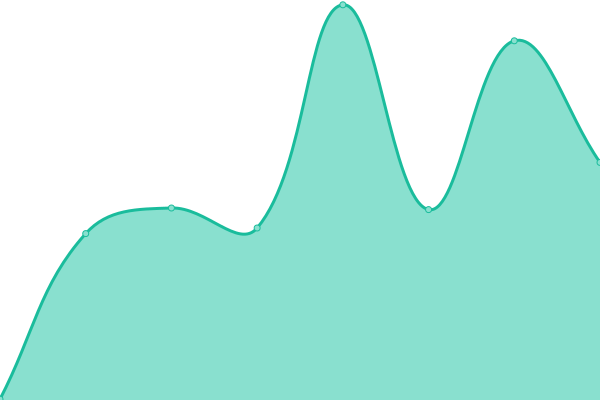
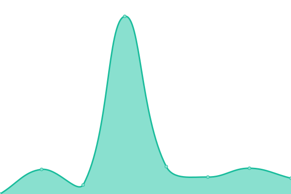
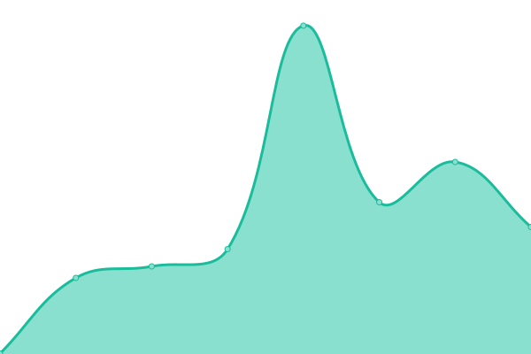
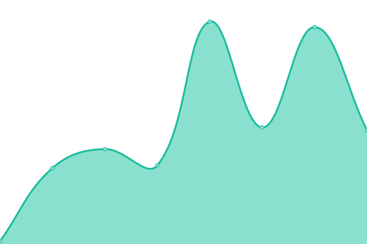

# [📈 Live Status](https://demo.upptime.js.org): <!--live status--> **🟥 Complete outage**

This repository contains the open-source uptime monitor and status page for [Upptime](https://upptime.js.org), powered by [Upptime](https://github.com/upptime/upptime).

With [Upptime](https://upptime.js.org), you can get your own unlimited and free uptime monitor and status page, powered entirely by a GitHub repository. We use [Issues](https://github.com/upptime/upptime/issues) as incident reports, [Actions](https://github.com/r0manu3l/inswhub/actions) as uptime monitors, and [Pages](https://demo.upptime.js.org) for the status page.

<!--start: status pages-->
<!-- This summary is generated by Upptime (https://github.com/upptime/upptime) -->
<!-- Do not edit this manually, your changes will be overwritten -->
<!-- prettier-ignore -->
| URL | Status | History | Response Time | Uptime |
| --- | ------ | ------- | ------------- | ------ |
|  [Business Portal Dashboard](https://dashboard-ish.apps.ins.inswhub.com/login) | 🟥 Down | [business-portal-dashboard.yml](https://github.com/r0manu3l/inswhub/commits/HEAD/history/business-portal-dashboard.yml) | 

 250ms
     
 | 

<a href="https://r0manu3l.github.io/inswhub/history/business-portal-dashboard">99.74%</a>
    

|  Business Portal Backend | 🟥 Down | [business-portal-backend.yml](https://github.com/r0manu3l/inswhub/commits/HEAD/history/business-portal-backend.yml) | 

 227ms
     
 | 

<a href="https://r0manu3l.github.io/inswhub/history/business-portal-backend">99.74%</a>
    

|  Authorization Server | 🟥 Down | [authorization-server.yml](https://github.com/r0manu3l/inswhub/commits/HEAD/history/authorization-server.yml) | 

 1723ms
     
 | 

<a href="https://r0manu3l.github.io/inswhub/history/authorization-server">99.75%</a>
    

|  Authorization Sever 2 | 🟥 Down | [authorization-sever-2.yml](https://github.com/r0manu3l/inswhub/commits/HEAD/history/authorization-sever-2.yml) | 

 1312ms
     
 | 

<a href="https://r0manu3l.github.io/inswhub/history/authorization-sever-2">99.75%</a>
    

|  Developer Portal | 🟥 Down | [developer-portal.yml](https://github.com/r0manu3l/inswhub/commits/HEAD/history/developer-portal.yml) | 

 813ms
     
 | 

<a href="https://r0manu3l.github.io/inswhub/history/developer-portal">99.75%</a>
    

|  Partners Sandbox | 🟥 Down | [partners-sandbox.yml](https://github.com/r0manu3l/inswhub/commits/HEAD/history/partners-sandbox.yml) | 

 1880ms
     
 | 

<a href="https://r0manu3l.github.io/inswhub/history/partners-sandbox">99.75%</a>
    

|  Partners Production | 🟥 Down | [partners-production.yml](https://github.com/r0manu3l/inswhub/commits/HEAD/history/partners-production.yml) | 

 43ms
     
 | 

<a href="https://r0manu3l.github.io/inswhub/history/partners-production">99.75%</a>
    

<!--end: status pages-->

[**Visit our status website →**](https://demo.upptime.js.org)

## 📄 License

- Powered by: [Upptime](https://github.com/upptime/upptime)
- Code: [MIT](./LICENSE) © [Upptime](https://upptime.js.org)
- Data in the `./history` directory: [Open Database License](https://opendatacommons.org/licenses/odbl/1-0/)
